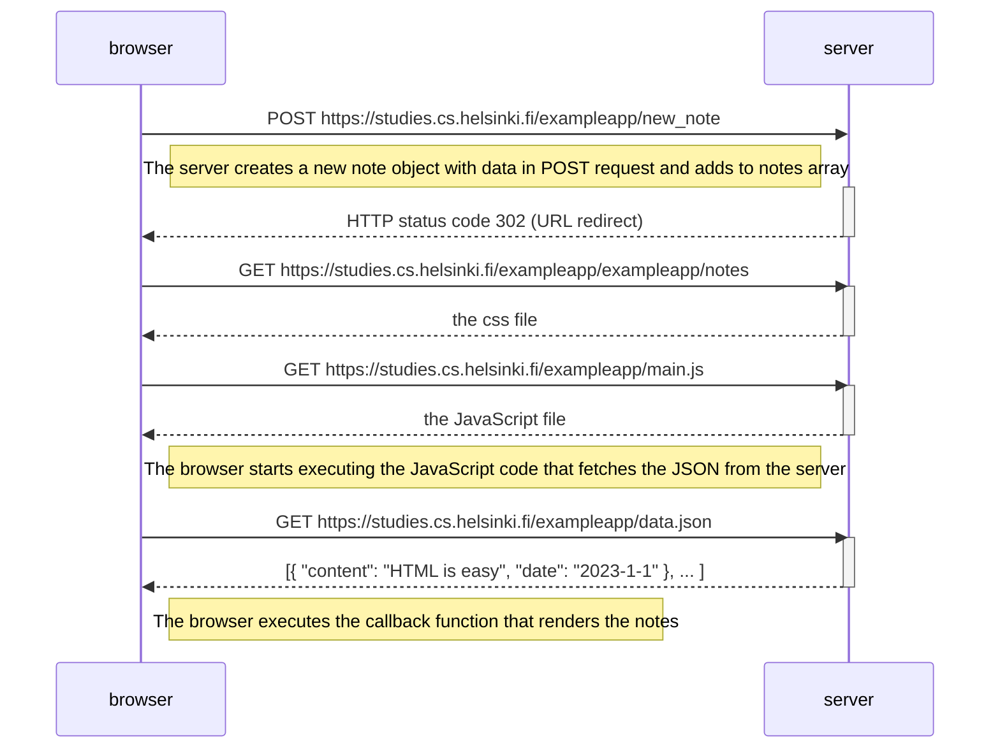

# Exercise 0.4
Objective: Create a diagram that depicts the browser and server exchange when user creates a new note on the page https://studies.cs.helsinki.fi/exampleapp/notes by writing something into the text field and clicking the Save button.

